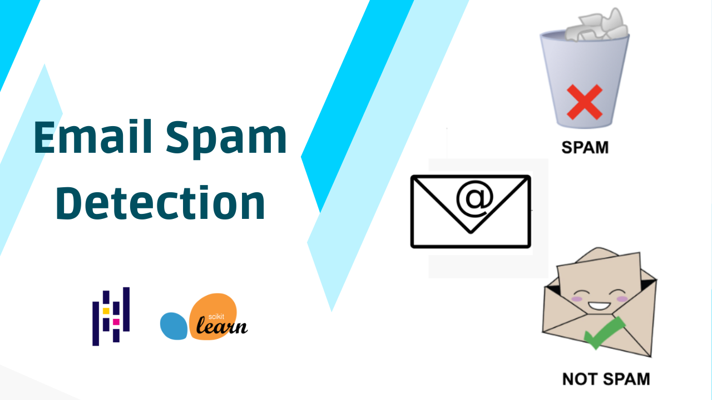

<!-- PROJECT TITLE -->
<h1 align="center">Email Spam Detection</h1>

<!-- HEADER -->
<p align="center">
  
</p>

<!-- PROJECT DESCRIPTION -->
## <br>**➲ Project description**
A machine learning approach called Natural Language Processing and Python is used in email spam detection systems. Given a dataset of several emails, we may identify whether or not an email is spam by extracting key terms and using a naive classifier.

<!-- PREREQUISTIES -->
## <br>**➲ Prerequisites**
The following is a list of packages and modules that must be installed for the project:
* <a href="https://www.python.org/downloads/" target="_blank">Python 3.x</a>
* Pandas 
* Numpy
* Scikit-learn
* NLTK

Install all required packages :
 ```sh
  pip install -r requirements.txt
  ```

<!-- THE DATASET -->
## <br>**➲ The Dataset**
About 5728 records in the Human Activities dataset are samples of emails,
and the target field "spam" indicates whether or not an email is spam.<br>

<!-- CODING SECTIONS -->
## <br>**➲ Coding Sections**
In this part we will see the project code divided to sections as follows:
<br>

- Section 1 | The Data :<br>
In this section we aim to do some operations on the dataset before training the model on it,
processes like :
  1. Data Loading : Load the dataset
  2. Data Visualization : Visualize dataset features
  3. Data Cleaning : Remove stopwords and duplicates values
  4. Data Splitting : Split the dataset into training and testing sets<br><br>

- Section 2 | The Model :<br>
When the dataset is prepared for training, we use scikit-learn to build a naive classifier and then fit it to the data. We then assess the model by obtaining the confusion matrix, classification report, and accuracy.<br>

<!-- INSTALLATION -->
## ➲ Installation
1. Clone the repo
   ```sh
   git clone https://github.com/25thOliver/EmailSpam.git
   ```
2. Open 'main.ipynb' in Google Colab or VScode and enjoy

<!-- REFERENCES -->
## <br>**➲ References**
These links may help you to better understanding of the project idea and techniques used :
1. Spam detection in machine learning : https://bit.ly/3nwiKtA
2. Naive-bayes algorithm : https://bit.ly/3zc9SLH
3. Model evaluation : https://bit.ly/3B12VOO

<!-- CONTACT -->
## <br>**➲ Contact**
- E-mail   : [oliversamwel33@gmail.com](mailto:oliversamwel33@gmail.com)
- X : |9https://x.com/Oliv3r_Sami)

